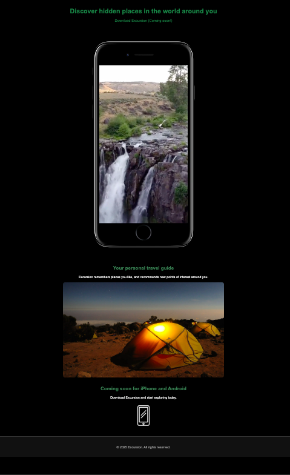

# 🌍 Excursion — Travel Landing Page

A minimal, stylish **landing page** for a fictional travel app called *Excursion*.  
Built with **HTML5 + CSS3**, with a modern **dark theme**.



## 🎯 Features

- 🔥 Dark mode design
- 🎥 Embedded video background
- 🖼️ Hero image & mobile app icon
- 📱 Fully responsive layout (coming soon)
- ✨ Clean, semantic code

## 🛠️ Technologies

- HTML5
- CSS3
- Git / GitHub

## 📸 Screenshot

> _Want to see the page live?_ Just open `index.html` in your browser!  
> To see the full video effect, make sure the video file is in `resources/videos`.


## 🧭 Structure

excursion/ ├── index.html ├── resources/ │ ├── css/ │ │ └── style.css │ ├── images/ │ │ ├── landscape.jpg │ │ └── phone-icon.png │ └── videos/ │ └── excursion.mp4


## 📸 Preview

> 💡 To view the page, open `index.html` in your browser.  
> Make sure video and images are in the correct folders.


## 🚀 Getting Started

Clone the repository and open `index.html` in your browser:

```bash
git clone https://github.com/your-username/excursion.git
cd excursion
open index.html
```
## 🙌 Author
Made with ❤️ by @TanyaDyakonova

